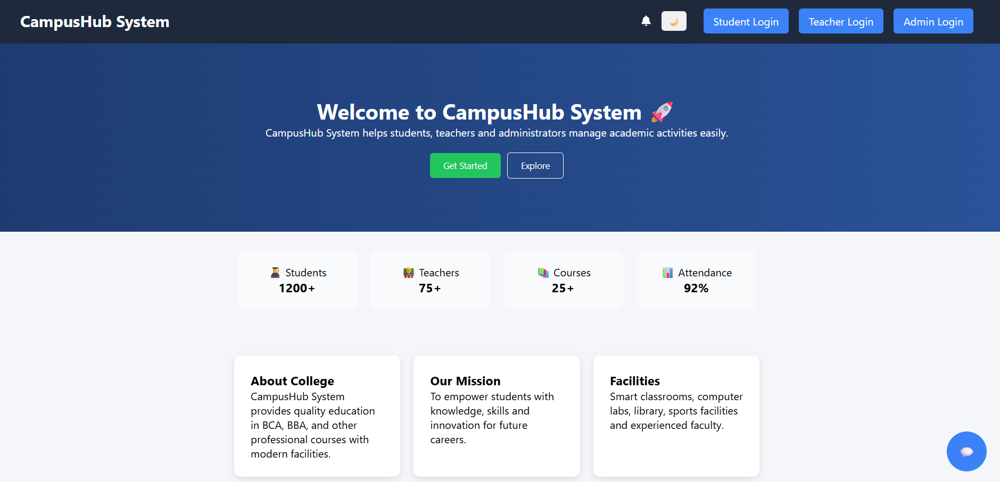
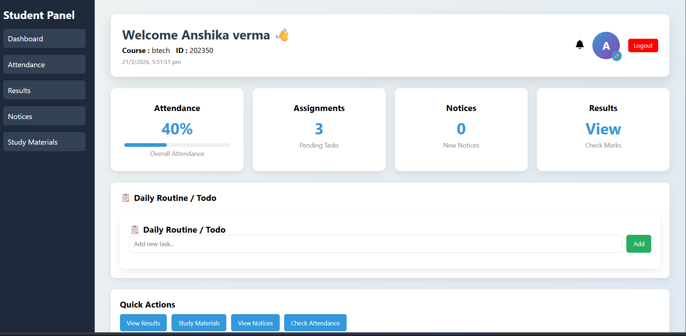
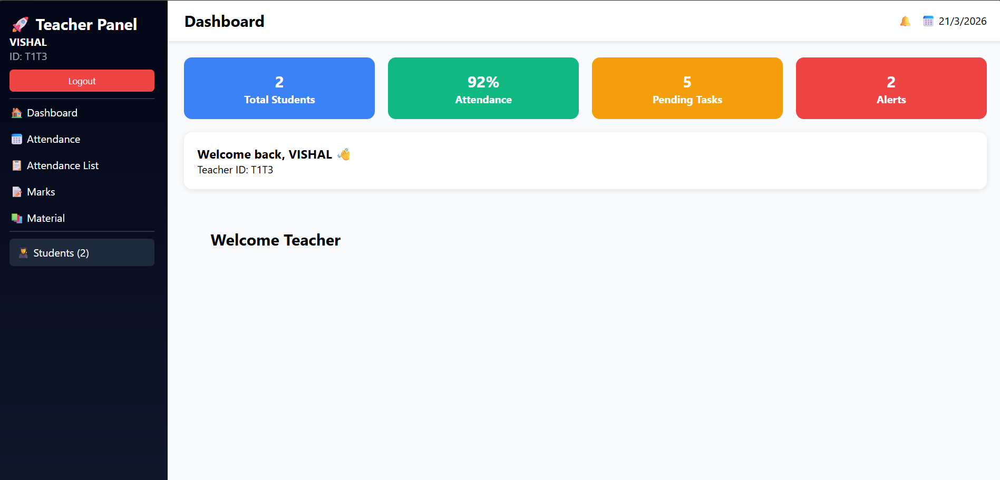
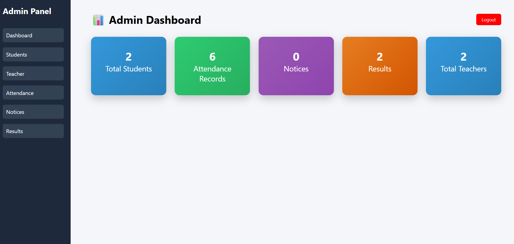

# 🎓 Campus Hub System

A full-stack MERN based college management system that helps students, teachers, and admins manage academic activities efficiently.

---

## 🚀 Features

- 👨‍🎓 Student Dashboard
- 👨‍🏫 Teacher Panel (Attendance & Marks)
- 🛠️ Admin Panel Management
- 📊 Attendance System
- 📚 Study Material Upload
- 🤖 AI Chatbot Integration
- 🔐 Secure Authentication

---

## 🛠️ Tech Stack

- Frontend: React.js  
- Backend: Node.js + Express  
- Database: MongoDB  
- Styling: CSS  

---

## 📸 Screenshots

### 🏠 Home Page


---

### 👨‍🎓 Student Panel


---

### 👨‍🏫 Teacher Panel


---

### 🛠️ Admin Panel


---

💡 Future Improvements
📱 Mobile Responsive UI
🔔 Notification System
📊 Advanced Analytics Dashboard
🤖 More Powerful AI Features

## ⚙️ Installation

```bash
git clone https://github.com/Aviral0005/CampusHubSystem.git
cd CampusHubSystem
npm install